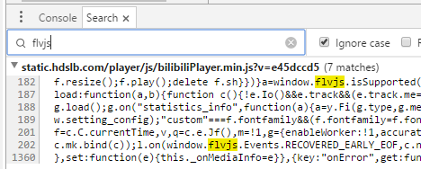
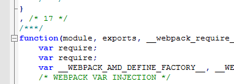
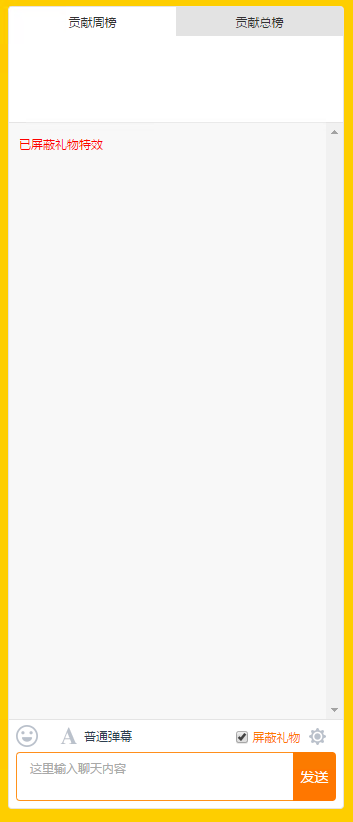
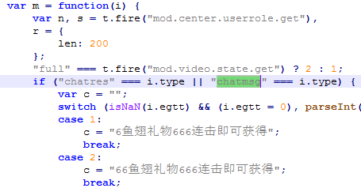

因为 flv.js 开源了,花了几天写了个斗鱼的HTML5播放器, 支持弹幕, 还在完善中.

[GitHub - spacemeowx2/DouyuHTML5Player: 替换斗鱼的Flash弹幕播放器](https://github.com/spacemeowx2/DouyuHTML5Player)

[Chrome 网上应用店: 斗鱼 HTML5 播放器](https://chrome.google.com/webstore/detail/hbocinidadgpnbcamhjgfbgiebhpnmfj)

<!--more-->

# 引入 flv.js

flv.js 是 27 号开源的, 而我开始写这个是从 26 号开始写的, 于是第一步就是把 flv.js 从 Bilibili 抠出来= =.

现在开源了只要 git clone 一下, 然后执行 `gulp release` 就行.

要找到 flv.js 在哪只要用 Chrome 的搜索功能, 如下图



这个 .min.js 文件实际上包含了 flv.js 还有播放器UI部分, 而我需要的只是 flv.js 而已. 通过观察发现, 在这个 webpack 过的 .min.js 里, flv.js 是单独的一个模块, 也就是说抠的时候只要把这一个模块拿出来就行.

于是只要把 flv.js 那个模块单独复制出来就行, 编号是 17 ( webpack 的注释太贴心了, 还帮你把模块的边界给分好了 )



# 使用 flv.js

前面说到了我刚开始写的时候, flv.js 是没有开源的, 也就是说是没有文档的, 虽然我认识 flv.js 的作者(@谦谦), 但也不能去问别人嘛, 毕竟还没有正式开源. 那么就只能通过观察 Bilibili 是怎么调用 flv.js 来猜测用法了.

因为 flv.js 是将整个模块导出到 `window.flvjs`, 所以 `flvjs` 这个名字不会被 uglify, 在源码中直接搜 `flvjs.` 就能搜到用法.

于是搜到以下代码

```js
    var k = document.createElement("video"), f = c.C.currentTime, v, q = c.e.Jf(), m = !1, g = {
        enableWorker: !1,
        accurateSeek: !0,
        seekType: g || "range",
        rangeLoadZeroStart: !0,
        lazyLoadMaxDuration: 180,
        deferLoadAfterSourceOpen: !1
    };
    if (c.u.browser.version.safari || c.u.browser.version.je || c.u.browser.version.lg)
        g.enableWorker = !1,
        g.lazyLoadMaxDuration = 120;
    var l = window.flvjs.createPlayer(e.U, g);
    l.currentTime = f || 0;
    l.attachMediaElement(k);
    l.load();
    l.on("statistics_info", function(a) {
        a = y.Fi(l.type, l.mediaInfo, a);
        c.Ma && !c.Ka && c.Ma.refresh(a)
    });
    l.on(window.flvjs.Events.ERROR, c.mk.bind(c));
    l.on(window.flvjs.Events.RECOVERED_EARLY_EOF, c.nk.bind(c));
```

可以看到它调用了 `flvjs.createPlayer` 并给了两个参数, 第二个参数是一系列选项, 第一个参数应该就是视频源了.

通过在 flv.js 中搜索 `deferLoadAfterSourceOpen` 能看到更多选项, 在这里列出来一下.

```js
defaultConfig = {
    enableWorker: !1,
    enableStashBuffer: !0,
    stashInitialSize: void 0,
    isLive: !1,
    lazyLoad: !0,
    lazyLoadMaxDuration: 180,
    deferLoadAfterSourceOpen: !0,
    statisticsInfoReportInterval: 600,
    accurateSeek: !1,
    seekType: "range",
    seekParamStart: "bstart",
    seekParamEnd: "bend",
    rangeLoadZeroStart: !1,
    customSeekHandler: void 0
}
```

在这里, `!1` 和 `!0` 分别是 `false` 和 `true`, 这样写主要是被 uglify 了, 为了省几个字节的空间 233

在 `createPlayer` 后依次调用了 `attachMediaElement()` 和 `load()`, 然后应该就是绑定事件了.

而第一个参数通过翻阅源码可以知道有 `type` 和 `url` 等选项.

于是就能在我的扩展程序里调用 `flv.js` 了.

```js
  const sourceConfig = {
    isLive: true,
    type: 'flv',
    url: videoUrl
  }
  const playerConfig = {
    enableWorker: false,
    deferLoadAfterSourceOpen: true,
    stashInitialSize: 512*1024,
    enableStashBuffer: true
  }
  const player = flvjs.createPlayer(sourceConfig, playerConfig)
```

# 获取斗鱼的直播流URL

这步就比较简单了, 本来想要用 ffdec 来逆一下斗鱼的 Flash 播放器的, 后来经人提醒, [you-get](https://github.com/soimort/you-get/blob/0984190f93bd0b5c55748c41ca657d1ba6bf5a6b/src/you_get/extractors/douyutv.py) 里有斗鱼模块, 于是只要翻译成 js 代码就行了.

# 解决 Mixed Content

因为斗鱼整站使用了 HTTPS 协议, 加上 Chrome 已经禁止了在 HTTPS 网页中使用 HTTP 非安全资源, 于是我在 Content Script 中调用 flv.js 来加载直播流会被阻止.

> Mixed Content: The page at 'https://www.douyu.com/667351' was loaded over HTTPS, but requested an insecure resource 'http://hdl3.douyucdn.cn/live/667351reaR571XqO.flv?wsAuth=8f6a24ca4093a8aedd…ac7dfeb0502c08311c0e9&logo=0&expire=0&did=...'.  
> This request has been blocked; the content must be served over HTTPS.  

因为 Content Script 是可以和 background 通信的, 于是我就想到换个地方获取, 用 background 来获取直播流.

通过调试得知 flvjs 是通过 fetch 来获取视频流的, 于是方法是 Hook 掉 fetch 方法, 通过和 background 通信来获取数据, 再发给 flvjs. 不过有点坑的是, 和 background 通信只能传 json 数据, 因此 Uint8Array 在这个过程中要被转成 Array 再转回来, 感觉还是挺损失性能的.

flv.js 用到 fetch 的哪些方法我就提供哪些, 其他先忽略(偷懒). 于是搜索 `fetch(`, 搜索结果只有一处:

```js
self.fetch(u, l).then(function(e) {
    if (n._requestAbort)
        return n._requestAbort = !1,
        void (n._status = c.LoaderStatus.kIdle);
    if (e.ok && e.status >= 200 && e.status <= 299) {
        var t = e.headers.get("Content-Length");
        return null != t && (n._contentLength = parseInt(t),
        0 !== n._contentLength && n._onContentLengthKnown && n._onContentLengthKnown(n._contentLength)),
        n._pump.call(n, e.body.getReader())
    }
    if (n._status = c.LoaderStatus.kError,
    !n._onError)
        throw new _.RuntimeException("FetchStreamLoader: Http code invalid, " + e.status + " " + e.statusText);
    n._onError(c.LoaderErrors.HTTP_STATUS_CODE_INVALID, {
        code: e.status,
        msg: e.statusText
    })
})
// _pump
function(e) {
    var t = this;
    return e.read().then(function(n) { // n 就是 getReader() 的返回值
        if (!n.done) {
            if (t._requestAbort === !0)
                return t._requestAbort = !1,
                t._status = c.LoaderStatus.kComplete,
                e.cancel();
            t._status = c.LoaderStatus.kBuffering;
            var i = n.value.buffer
                , r = t._range.from + t._receivedLength;
            return t._receivedLength += i.byteLength,
            t._onDataArrival && t._onDataArrival(i, r, t._receivedLength),
            t._pump(e)
        }
        t._status = c.LoaderStatus.kComplete,
        t._onComplete && t._onComplete(t._range.from, t._range.from + t._receivedLength - 1)
    })
    // ...
}
```

可以看到只用到了 `.ok`, `.status`, `.statusText`,  `.body.getReader()`, 还有 `reader` 的 `.read()` 和 `.cancel`

于是只要提供一个'残废'的 fetch 给 flvjs 就好啦 (逃

[background.js](https://github.com/spacemeowx2/DouyuHTML5Player/blob/b5a54240f1b31d53a8530af83444b10027fe6dca/src/background.js#L8)

[hookfetch.js](https://github.com/spacemeowx2/DouyuHTML5Player/blob/b5a54240f1b31d53a8530af83444b10027fe6dca/src/hookfetch.js)

这样在 Content Script 内使用 fetch 就没有 Mixed Content 问题了.

# 加上弹幕

搞完上面4步就已经能播放直播了, 但是没有弹幕, 右边的聊天室也没有. 因为 Flash 已经被我干掉了嘛, 而且弹幕也是通过 Flash 获取的, 而这又是一个巨坑...

## 建立连接 

因为 Flash 播放器是直接连 TCP 的, 而纯 JS 是完成不了的...HTML5 有 WebSocket 然而斗鱼的弹幕服务器并不支持.

于是在 GitHub 上找了个 [JSocket](https://github.com/nihen/JSocket) 然后魔改了一下, 比如把 Flash 和 JS 的通信用 Base64 编码了一下, 因为斗鱼的弹幕协议是二进制包而不是基于字符串的.

## 实现传输协议

TCP 协议抽象了一个流, 因此你发送的两个包可能会合成一个或者拆成多块被接收, 于是斗鱼自己搞了个协议. 大致是这样:

前 12 字节是包头, 前两个 DWORD 存放包长度, 然后一个 WORD 用来区分是客户端发送还是服务端发送的包, 再后面两个字节保留不用, 最后连上包的内容, 并以 `'\0'` 结尾

于是我用 JS 实现了一遍这个协议(不想用AS3写这个...)

[接收并解包](https://github.com/spacemeowx2/DouyuHTML5Player/blob/b5a54240f1b31d53a8530af83444b10027fe6dca/src/douyuClient.js#L57)  [发送包](https://github.com/spacemeowx2/DouyuHTML5Player/blob/b5a54240f1b31d53a8530af83444b10027fe6dca/src/douyuClient.js#L100)

除此之外, 斗鱼还造了一个转义规则, 将 Key-Value 对转义成字符串. 实现代码如下:

[转义字符串](https://github.com/spacemeowx2/DouyuHTML5Player/blob/b5a54240f1b31d53a8530af83444b10027fe6dca/src/douyuClient.js#L8-L31)

每个包其实都是个 js 的 Object. 每个包都有一个固定的 key : `type`, 不同的功能通过不同的 type 来区分.

## 实现弹幕接收

通过抓包发现, 斗鱼的 Flash 播放器其实连了两个弹幕服务器, 一个专门用于接收弹幕, 另一个用于传输房间信息, 送礼物和发送弹幕, 好在传输协议都一样, 只是功能不一样而已. 之后我把前者叫做弹幕服务器, 另一个叫做信息服务器.

信息服务器:

连上服务器后客户端先发送一个 [loginreq](https://github.com/spacemeowx2/DouyuHTML5Player/blob/b5a54240f1b31d53a8530af83444b10027fe6dca/src/douyuClient.js#L142) 包, 然后服务器会返回一系列房间信息, 如在线人数, 你的礼物数量, 以及弹幕分组.

之后客户端的所有操作均通过这个服务器交互, 如送礼物, 领礼物, 发送弹幕等.

弹幕服务器:

其实斗鱼的弹幕是有分组的, 每个组有个 id 在包里叫 `gid`, 所有人根据一定的规则进入不同的组, 这样每个人接收到的弹幕就不至于太多. 当然你也可以选择`海量弹幕模式`, 这个模式相当于能接收所有组的信息, `gid` 是个特殊值: -9999.

连上服务器后也是先发送一个 `loginreq` 包, 然后根据信息服务器的指令加入弹幕组. 然后就能接收到弹幕信息了, 弹幕的 `type` 是 `chatmsg`. 其他信息如别人的送礼信息, 进入房间也是通过弹幕服务器传输.

## 与斗鱼的 JS 模块交互

我的扩展程序已经能接收弹幕了, 然而右边的弹幕框还是不能用. 这是因为斗鱼的 JS 模块是通过和 Flash 交互来显示和发送弹幕的.



那么一样是用 Hook 方法, 把我写的扩展程序伪装成原来的 Flash 播放器来和斗鱼的 JS 模块交互就能让右边的起作用了.

第一步是找到他交互的接口. 通过上一步可以知道弹幕的 type 是 `chatmsg`, 于是在斗鱼的 Source 里搜索 `chatmsg`.



这应该就是显示弹幕的地方了, 因为底下的那些提示是徽章的提示.

通过查找函数 `m` 的引用可以找到如下代码

```js
l.reg("room_data_chat",
function(e) {
    m(o.decode(e).too())
}),
l.reg("room_data_chat2",
function(e) {
    m(o.decode(e).too())
}),
```

`l.reg` 应该就是绑定从 Flash 传来的事件了.

查看这个模块的 `l` 的定义, 这个模块的名字是 `douyu/page/room/base/api`, 于是去找 `define("douyu/page/room/base/api"`

可以看到 Flash 传来的事件都叫 `room_data_xxx`, 从 JS 传给 Flash 的事件都叫 `js_xxx`

[Hook 代码](https://github.com/spacemeowx2/DouyuHTML5Player/blob/b5a54240f1b31d53a8530af83444b10027fe6dca/src/douyuClient.js#L283)

Flash 传给 JS 的事件通过 _ACJ_ 调用, 因此我只要调用 _ACJ_ 和适合的参数就能让右边显示出弹幕.

# 渲染弹幕

上一节只是让弹幕能传到网页中来, 而播放器上并没有弹幕, 这一节就来显示一波弹幕.

<!--渲染弹幕我使用了 CSS 的 transition, 因此让弹幕移动起来只要设置好 `transform` 属性就好.

为了让弹幕不追尾, 必须计算每次弹幕要从哪行发出来. (顺便吐槽一下某直播平台经常追尾).-->


-- 未完待续 --