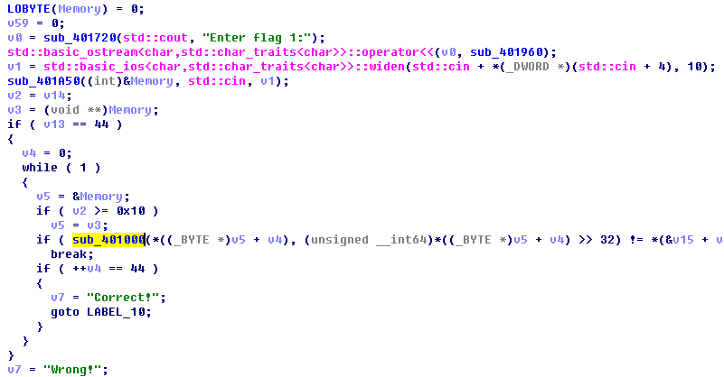
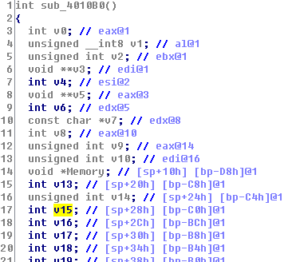
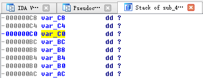
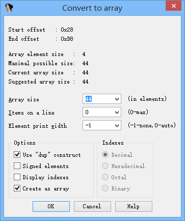
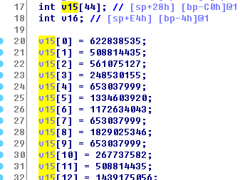
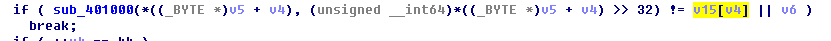
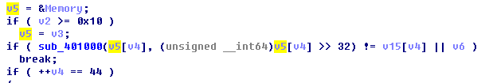
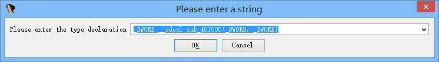
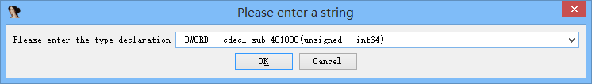
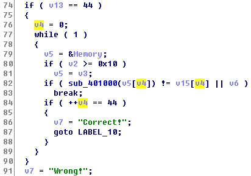

# IDA技巧

IDA是个好东西, 不过他还不够智能, 许多时候需要调教一下才好用.

<!--more-->

这里拿 ZCTF2017 的 misc400 的一个小程序 [start here.exe](https://ojiju7xvu.qnssl.com/blog/start%20here.exe) 举例.

以下是 ida 一开起来 F5 的结果, 未做任何改动.



在 0x4010B0 函数里, 大致可以看出调用了 cin, 把输入放到了 `Memory` 变量里. 图里的循环会在输入不等于 `*(&v15 + v4)` 时退出并输出 "Wrong".

首先先把 v15 变成数组, 操作方法如下:

首先把光标移到 v15 上, 按 `Enter` 或者双击 v15



然后跳转到这里, 按 `*` 号



根据汇编判断, 这里有 44 个 DWORD. 如果类型和想要的不一样, 可以先在 Stack 上面对着变量按 `D`, 使类型改变再按 `*`.



接下来换回伪代码界面就能看到这样了.



同时, 之前的 `*(&v15 + v4)` 也变成了 `v15[v4]`.



现在左边这个 sub_401000 里的参数还是很奇怪.

现在我们对 v5 进行分析. v5 一开始是被 ida 分析成 `void **` 类型, 而对 v5 的所有读取前面都有个 `_BYTE` 类型转换, 说明他的类型应该是 `_BYTE*` 才对. 因此我们对 v5 的类型进行修改: 光标移到 v5, 然后按 `Y` 键, 输入 `_BYTE*`, 再按回车.



然后伪代码就变成了这样, 已经比一开始好看多了.

不过还是很奇怪, 从逻辑上来说, v5 应该就是 1 字节的整数, 为什么会对他 >> 32? 原因其实是这里的参数不是两个 DWORD, 而是一个 QWORD. 因为是32位程序所以才用了这种方式传参.

为了改变函数的参数, 需要把光标移动到 `sub_401000` 上, 然后按 `Y`.



修改里面的两个 `_DWORD`, 变成这样:



最后, 伪代码就很好看了



和一开始比比


接下来就不用看了, 可以认为 `sub_401000` 是个映射函数, 把每个输入的 char 映射到一个 int 上, 最后再和写死的数组比较.

顺便再给一个 idapython 脚本, 用来生成这个映射表.

```python
stupidmap = Appcall.proto('stupidmap', "int __cdecl stupidmap(__int64 a1);")

out = []
for i in range(256):
    out.append(stupidmap(i))
print out
```
