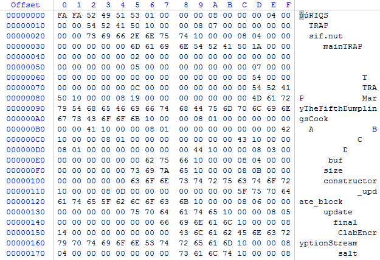
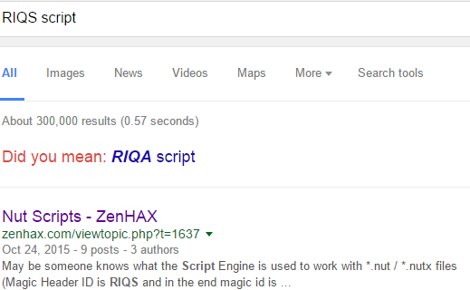
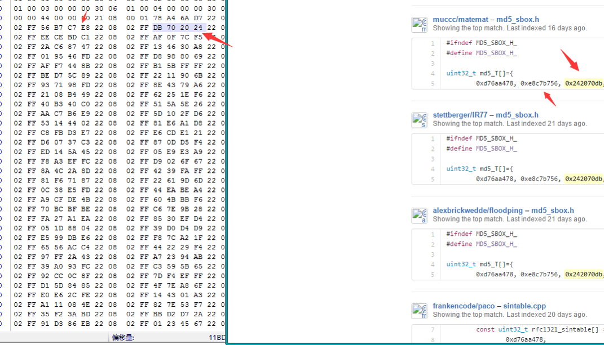
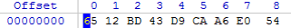
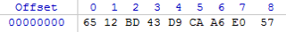
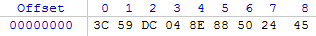
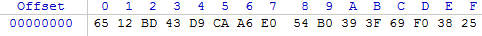
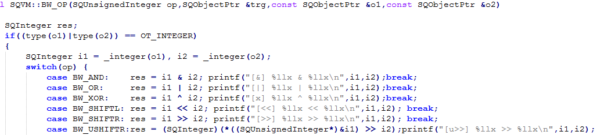
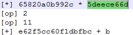

清明研究了点Flash, 但是没啥进展..就讲一讲上次bctf的题好了, 感觉能开拓解题思路.  
<!--more-->

## 1. 首先知道RIQS是个啥文件

  
  
可以知道是SQUIRREL脚本  

## 2. 下载SQUIRREL3并编译让他跑起来

RIQS 是 SQUIRREL 脚本的编译后的文件.  
一开始在 Cygwin 编译不能运行, 查找错的地方发现他是64位的, 而我的 Cygwin 是32位的, 于是滚到 Ubuntu 编译.  
运行后提示用法为 sif 文件 key  

## 3. 分析算法

先用 WinHex 围观一下, 发现一堆常数, 在 GayHub 搜索得知是MD5的常数
  

## 4. 黑箱测试

使用简单的输入, 观察输出结果来推测规律.  
以下分别是内容-key为 1-1, 2-1, 1-2的结果  
  
  
  

可以看出前8字节和 key 有关, 然后开始和内容有关.  
因为加密后内容没有变大, 所以猜测是异或加密  
由上一步得知算法中有 md5 的计算, 因此对 key 进行 md5 然而并不是.  

## 5. 插桩调试

观察源码可以发现 SQUIRREL 是对编译后的文件解释执行,没有用到 JIT , 因此可以在 vm 里添加代码来查看想要的信息. 比如在连接字符串的函数里输出连接后的结果.   
运行后发现程序将文件名和 key 连接起来算 md5 , 于是把'11'进行 md5 计算得到 `6512bd43d9caa6e0`2c990b0a82652dca.  
前面一半部分就是文件的前8字节  

对内容12345678, key:1进行加密, 得到如下内容  
  

把54b0393f69f03825和3132333435363738进行异或, 结果是`65820a0b`5cc60f1d  
对照MD5: 6512bd43d9caa6e02c99`0b0a8265`2dca  
可以看出是用异或加密的, 但是除了前4字节就找不到是用什么加密的了  
于是继续插桩, 在所有运算符中都输出一下  
  

一开始插桩的代码我是用%x输出数值, 后来发现是64位的整型, 走了点弯路…不过最后还是发现应该是64位.   
  

为了搞清楚程序的流程, 我把所有的 OP 编码都输出了出来, 发现这个运算是在一个生成器里发生的, (操作码里有针对生成器的操作))  

## 6. 总结

黑箱测试能方便的发现程序的特点, 比如初中的时候有个人写出了百度贴吧的验证码识别, 识别率听说是100%, 但是经过黑箱测试, 替换图片后却不能正确识别(hosts), 于是得知是通过URL解码得到的验证码.  
插桩调试能得知程序的执行流程, 适合简单的算法, 因为还原需要连蒙带猜所以还需要想象力2333  
