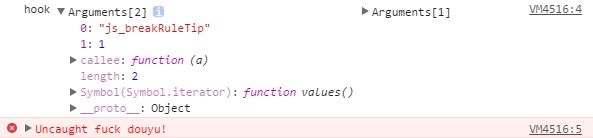

## Why
斗鱼会在你进入直播间一定时间后弹出一个框, 如果你在全屏状态, 包括网页全屏和全屏状态, 就会把你退出全屏, 给你看那些辣鸡信息  
<!--more-->
***
## Analysis
使用各种方法找到了退出网页全屏的代码, 比如网页全屏后的class啥的   
```javascript
k.pageFull = function() {
    var b = a("body"),
    c = a("#" + h.flash.id),
    d = c.parent();
    document.body.style.overlfow = "hidden",
    document.documentElement.style.overflow = "hidden",
    d.addClass(h.fullClass.flashBox),
    b.data(h.flash.full_key, !0).addClass(h.fullClass.bodyBox)
},
k.pageNorm = function() {
    var c = a("body"),
    d = a("#" + h.flash.id),
    e = d.parent();
    document.body.style.overlfow = "auto",
    document.documentElement.style.overflow = "auto",
    e.removeClass(h.fullClass.flashBox),
    c.data(h.flash.full_key, !1).removeClass(h.fullClass.bodyBox),
    b.trigger("mod.chat.height.change")
},
// ......
b.on("mod.video.state.norm",
function() {
    k.pageNorm()
}),
b.on("mod.video.state.flashnorm",
function() {
    var a = b.fire("mod.video.state.get");
    a === h.flash.state.full && g.exe("js_breakRuleTip", 1)
}),
g.reg("room_bus_pagescr",
function() {
    k.pageToggle()
}),
```
其中k是一个外部访问不到的变量, b是 `shark/observer` , 一个事件中心. g是给flash交互用的.  
根据对 js 的分析, 没有对 pageNorm 的直接调用, 只有调用 flashnorm.  
查看 flash 的代码, 发现在 js_breakRuleTip 中会调用`$.asTojs("room_bus_pagescr",null);`, 也就是说 flash 又反过来调用了js  

那么 patch 的方法最有效的应该就是把 js_breakRuleTip 给干掉了, 因为 js_breakRuleTip 也有在别的地方直接调用的.  

***
## Patch
以下是最终调用 flash 的部分, patch 就从这里下手, 如果只是对 g.exe 进行 patch 的话姿势就不够特殊了嘛...我就假设他的这些命名空间全被隐藏在了某个地方无法直接访问到来进行 patch  

```javascript
k = function(flashID) {
    var methodRef, methodName = arguments[1],
    params = [].slice.call(arguments, 2),
    isIE = navigator.appName.indexOf("Microsoft") >= 0,
    flashObj = isIE ? window[flashID] : document[flashID];
    flashObj && (methodRef = flashObj[methodName]) && methodRef.apply(flashObj, params)
}
```

可以看到他调用了 [].slice 于是思路就是对 [].slice patch, patch方法如下:
```javascript
var sliceBackup = Array.prototype.slice;
Array.prototype.slice = function () {
	if (this[0] && (this[0] == 'js_exitFullScreen' || this[0] == 'js_breakRuleTip')) {
		console.log('hook', this, arguments);
		throw "fuck douyu!";
	}
	return sliceBackup.apply(this, arguments);
}
```
其中 this 就是 [].slice.call 的第一个参数, 于是只要检测 `this[0]` 的方法是不是在黑名单就好了. 在黑名单的话直接扔一个错误就能中断执行.  



最后打一波广告 [直播关注助手@Chrome商店](https://chrome.google.com/webstore/detail/kaiofkekiongfpgocmlpomimfnmcnfii) 自带这个功能哦, 记得在选项里勾选 `使用无礼物显示的播放器(仅支持斗鱼tv)`  