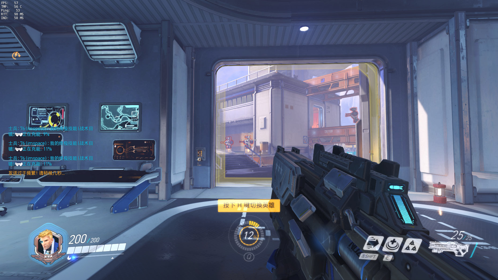
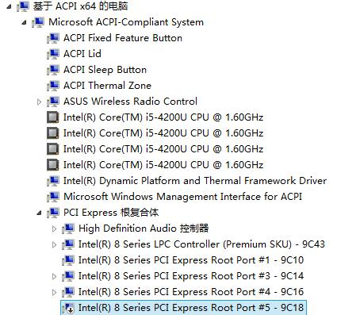

<style>.heimu {background-color: black !important;color: black !important;text-shadow: none !important;}</style>
因为最近在玩守望<span class="heimu">屁股</span>先锋, 然而笔记本的 840m 又带不动 1080p 的显示屏, 所以就想升级一下笔记本...  


(之前用内置的独显的话, 画质全最低, 渲染50%都跑不满帧...可见有多烂)  

<!--more-->

然而你懂的, 像我这种笔记本要升级只能再买一台了... 于是寻找黑科技, 最终找到了 EXP GDC, 淘宝有卖, 不贴链接  

因为理论上外接显卡会消耗10%~30%的效率且显卡性能越高, 损耗越大. 毕竟是用无线网卡的接口来传输数据.  

## 硬件
硬件其实挺简单的...不到半小时就装好了, 只要拆一下无线网卡, 把转接器接上, 显卡和电源一插就好.  

## 软件
最恶心的就是这一步了= = 装完驱动以后, 看设备管理器, 显示正常, 但是会多一个内置的独显. 这个内置独显就让你完全装不了驱动, 每次装完驱动, 就算之前禁用了, 也会被安装程序自动启用, 然后让你的电脑以为你只在用内置独显..就是这个坑让我的大屏幕黑了一下午, 而我只能盯着笔记本的小屏幕看  

根据卖家介绍使用了DIY eGPU, 这东西是个神器, 然而也是个大坑.  首先这套软件是好几年前的东西, 所以对UEFI的支持不太好(在我电脑是这样). 一开始我用U盘启动DIY eGPU, 后来因为不能从UEFI继续启动系统, 所以进PE把启动方式改成了MBR, 一阵调试终于能从DIY eGPU进入系统了  

在配置DIY eGPU的mkdevcon时, 会提示找不到PCIBUS, 其实意思是让你自己把PCIBUS的那段删掉, 而不是需要这段数据..
  
跨过mkdevcon的坑以后还有一个ichip的坑, 因为是几年前的套件, 所以最多也就支持到Intel 7系列的芯片组, 而我的笔记本是8系列的. 翻阅`:\core\intel.txt` 得知要用 `setpci -s 0:1f.0 2.w`命令来获取硬件ID, 然后就是把这个DID添加到intel.txt, 比如我的R553LN需要加这样一行:  
```
;Test your chipset is defined correctly by running 'ichip'

;添加下面这行
0x9c43   HM86     2    8     -1

; Series-7 Chief River (5GT/s)
0x1e55   QM77     2    8     62
0x1e56   QS77     2    8     62
```
然后就是参考Jason的博文[折腾无极限——笔记本也要上台式显卡，EXP GDC外置显卡内屏实战](http://vnimy.com/465.html)中的方法2, 编写startup.bat.  
我的startup.bat内容如下:
```bat
call iport off 5
call iport g2 4
call vidwait 60 10de:1402
call vidinit -d 10de:1402 
call iport reset 4
call iport init 4
call pci
call grub4dos win7
```
第一行的5是内置独显的端口号, 后面的4是外置独显的端口号, 然后10de:1402就是显卡ID, 可以参考上面的博文来找  

然后其实他的那些grub4dos脚本有些也是有问题的, 需要根据实际情况稍微修改一下, 比如WIN7我就改成了下面两句:
```
find --set-root /prim
chainloader /bootmgr
```
为了防止有时候U盘里也有bootmgr而造成歧义, 所以就建了个叫prim的文件放在活动分区  
这时进入系统看设备管理器应该就只有集显和外置独显了, 最后装一下驱动就好了  
不说了我现在很兴奋, 想多找几个游戏玩玩233  

---
2016年6月23日更新  
后来发现只要禁用掉内置独显的 PCI-E 接口就好了...真是瞎折腾了一天= =  
  
DIY eGPU已删  